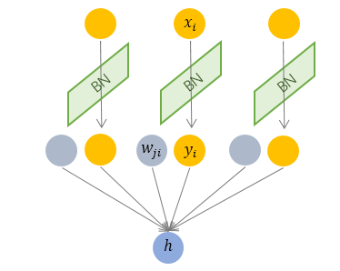

# Basic idea of normalization

## Internal Covariant shift
The fundamental assumption of statistical machine learning is:

> The data distribution in the source domain is the same as one in the target domain

New machine learning questions are given out while the data distribution is not the same in these two domains, such as transfer learning and domain adaptation.

The covariant shift was a branch question when this fundamental assumption breaks. It stands for only  conditional probability is the same while marginal probability is different:

$$
P_s\left(Y|X=x\right) = P_t\left(Y|X=x\right)
$$

$$
P_s\left(X\right) \ne P_t\left(X\right)
$$

For a deep neural network, with the internal layer operation, the data distribution will significantly change compared to the input data.

However, the label represented by the output is invariant, having the same distribution as the input.

Thus the input and output have the covariant shift, caused by the internal operation, named after with Internal Covariant Shift (ICS)

## Influence of ICS
- Upper-level networks should adapt to new data distribution, slowing training speed.
- The output of the lower network can vary in an extensive range, resulting in data approach to saturation range and stopping training
- The parameters update of each layer will influence all layers.

## Goal of normalization
**Whitening** input data:
- Excluding dependent properties and characteristics.
- Making distribution have the same mean and standard deviation.

However, standard whitening is expensive. Thus, the normalization method, a straightforward translational and rotational linear transformation, is invented to solve ICS.

A general normalization transformation can be expressed as:

$$
    h = f\left(\mathbf{g}\frac{\mathbf{x} - \mu}{\sigma} + \mathbf{b}\right)
$$

- $\mu$: shift parameter
- $\mathbf{b}$: re-shift parameter
- $\sigma$: scaling parameter
- $\mathbf{g}$: re-scaling parameter

Re-shift and re-scaling parameters ensure the model's ability after adding a normalization layer.
With the first normalization, all data will be distributed with zero mean value and unit deviation. The re-shift and re-scaling parameters adapt for learning from the input data. Otherwise, the input data distribution will be tedious (uninformative).

# Type of normalization

## Batch normalization

$$
\mu_i = \frac{1}{M}\sum x_i, \ \ \ \sigma_i = \sqrt{\frac{1}{M}\sum\left(x_i - \mu_i\right)^2}
$$

- $M$: Batch size.

Batch normalization normalize each **dimension** of model **independently**. This factor requires the input have a similar distribution in each dimension.

This will work for big batch size data or mini-batch data with low deviation.

## Layer normalization

Unlike batch normalization, layer normalization considers the input of all dimensions of one sample, preventing data dependence.

This feature makes layer normalization suitable for:
- Mini-batch training
- RNN and NLP

# Reference
[详解深度学习中的Normalization，BN/LN/WN](https://zhuanlan.zhihu.com/p/33173246)