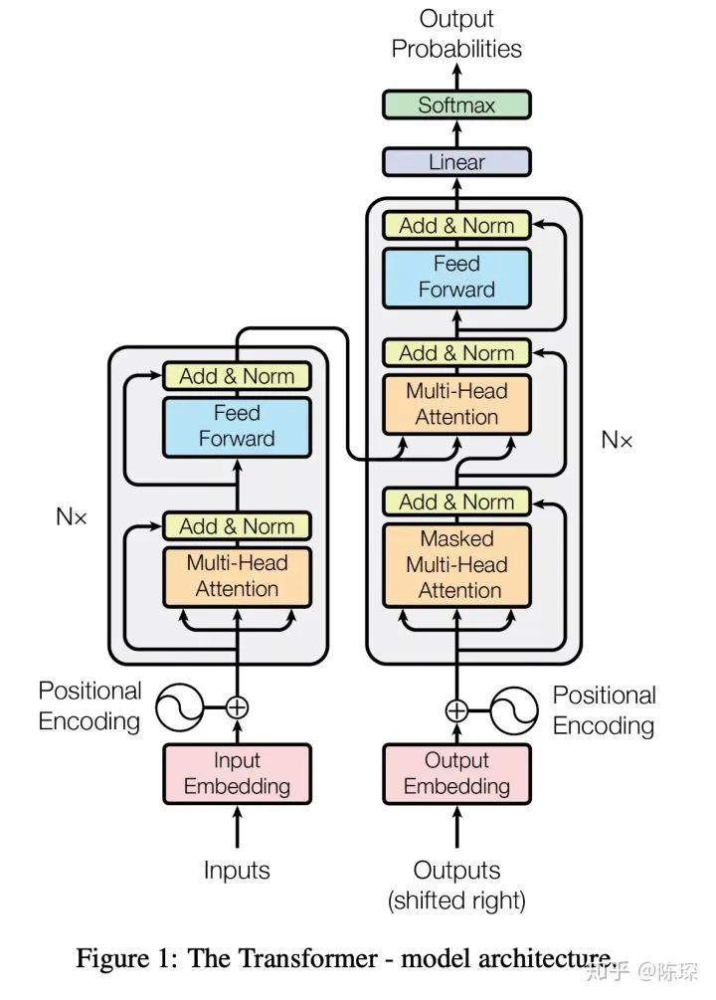
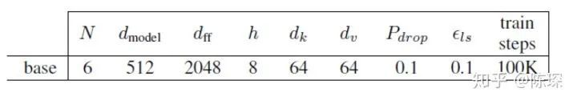
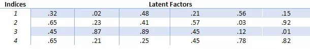
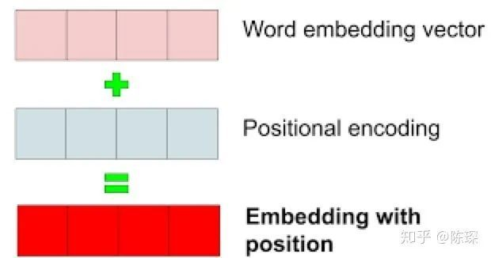
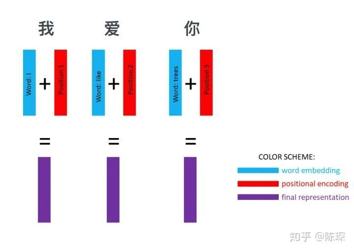
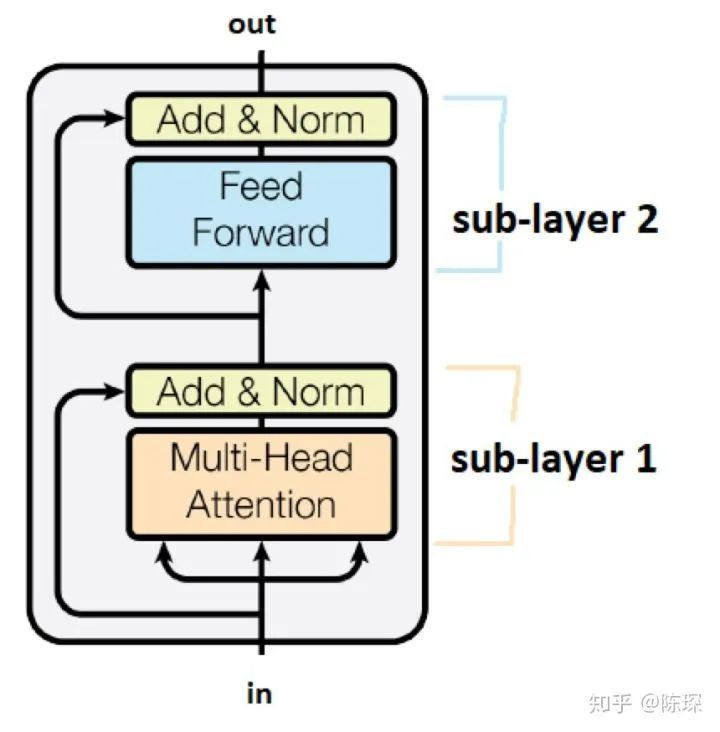
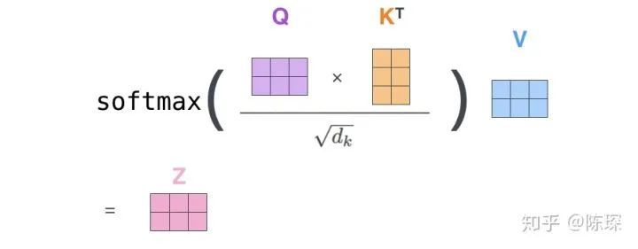

# Hyperparameter

- $N$: The layer of encoder and decoder
- $d_{model}$: The number of elements in the dictionary
- $d_{ff}$
- $h$: The number of heads

# Input representation

## Word embedding
Replace one-hot representation of large directory, increasing efficiency.

## Position encoding

Equation used to calculate the position encoding:
$$
PE_{pos, 2i} = \sin\left(\frac{pos}{10000^{2i/d_{model}}}\right)
$$
$$
PE_{pos, 2i+1} = \cos\left(\frac{pos}{10000^{2i/d_{model}}}\right)
$$

, where:
- $pos$: The position of element in the input vector

## Summary

The input tensor shape:

$$
\left[\mathrm{batch\_ size}, L, d_{model}\right]
$$

- $L$ is the length of sequence, here $L = 3$

# Encoder Layer

## Sub-layer 1: Multi-head attention

Input: $x$, the representation of sequence

Using different linear layer computing:
- key: $k = \mathrm{linear}_k(x)$
- query: $q = \mathrm{linear}_q(x)$
- value: $v = \mathrm{linear}_v(x)$

Calculating Attention:
$$
\mathrm{Attention}(Q, K, V) = \mathrm{softmax}\left(\frac{QK^T}{\sqrt{d_K}}\right) V
$$

- $\sqrt{d_K}$
    > We suspect that for large values of dk, the dot products grow large in magnitude, pushing the softmax function into regions where it has extremely small gradients

$\mathrm{Softmax}$ term give a $[0, 1]$ value represents the attention weight and average the value give the final attention result

## Sub-layer 2: "simple，position-wise fully connected feed-forward network"

A simple Feed-Forward network

$$
\mathrm{FFN}(x) - \max(0, xW_1+b_1)W_2 + b2
$$

# Decoder Layer

## Encoder-decoder multi-head attention