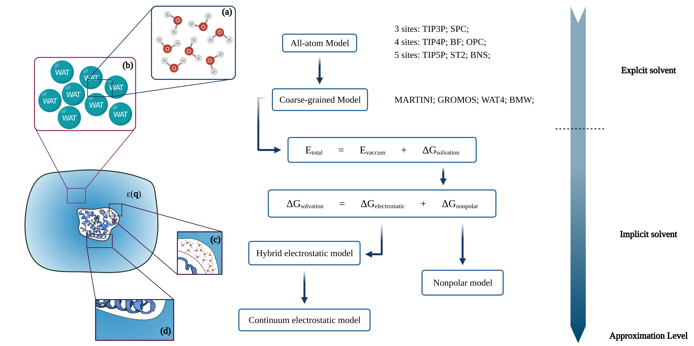
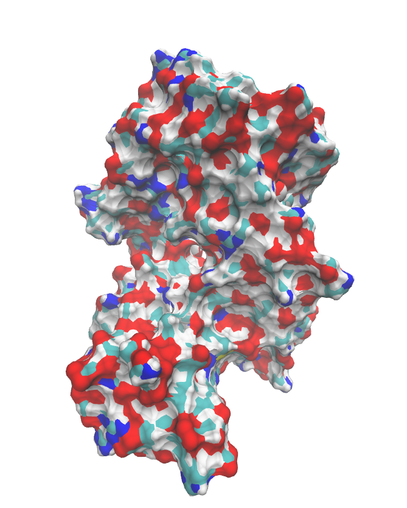
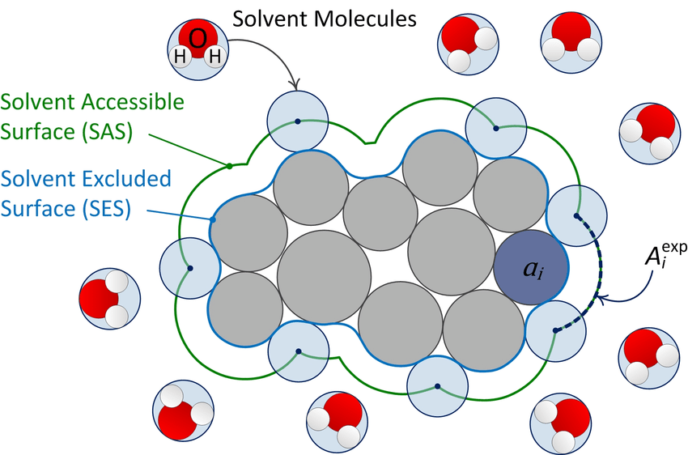
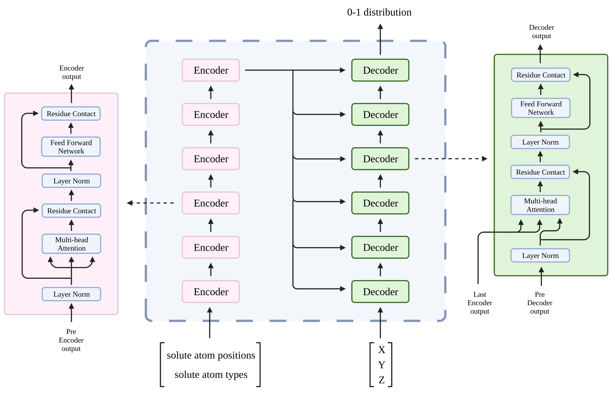
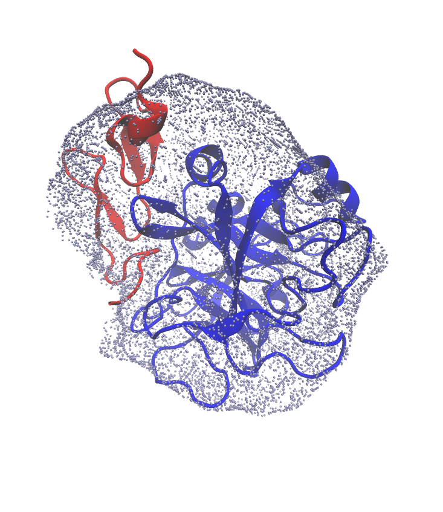

# A differentiable representation of 
# solvent-solute interface

 

Reporter: **Zhenyu Wei** 

Mentor: **Yunfei Chen**

School of mechanical engineering
Southeast University

---

## 
 Inspiration 

---

### Implicit solvent model

---

### Poisson-Boltzmann Equation

 

$$
\nabla\varepsilon(\mathbf{r})\nabla\phi(\mathbf{r}) = - \rho_{mol}(\mathbf{r}) -\lambda(\mathbf{r})\kappa^2\mathrm{sinh}\left(-\frac{z_+e\phi(\mathbf{r})}{kT}\right) 
$$

 

A <b>differentiable</b>  expression of $\varepsilon_r$ is vital for a precise solution of **Poisson-Boltzmann Equation** (PBE)

---

<!-- _class: split -->

&ensp;<b> PBE for globular protein </b>
 

- The surface can be interpreted as a **complex spatial distribution**
  
- The spatial distribution is highly **non-linear**

- The distribution depends on all of the atom's **position** and **type**

&ensp;&ensp;&ensp;&ensp; PDB id of protein shown right: 1A1N

---

### Current solution: Van der Waals surface

---

### Current obstacles

- Representation is **not smooth**

- Representation is **not expressed explicitly**

- Representation based on **Hard sphere model**
    - Highly approximated
    - Hyper parameter required

### Target

A smooth, differentiable, interface representation for solution of **PBE**

---

## 
 Method 

---

### Basic Idea

- Using deep neural network to represent the non-linear interface

- Deep neural network are naturally differentiable

### Obstacle

- Handling length-varied input: the positions and types of protein's atom

---

### Architecture

---

### Dataset

 

- Downloaded **12748** structures from PDB website

- Patched and solvated **10962** structures in $60\times60\times60\ A$ box

- Currently, sampled **4458** structures

  - Label solution atom as 1
  
  - Label solvent atom as 0

---

## 
 Result and discussion 

---

<!-- _class: split -->

 

&ensp;<b> Feasibility test </b>

- Train network on tiny dataset

  - 28 protein structures

  - Each with 25 samples

- Average accuracy: 92%  

- Isosurface with output value of TSSIR between [0.495, 0.505]

&ensp;&ensp;&ensp;&ensp; PDB id of protein shown right: 1IQG

---

## 
 Thanks for your attention 

## 
 Q & A 
